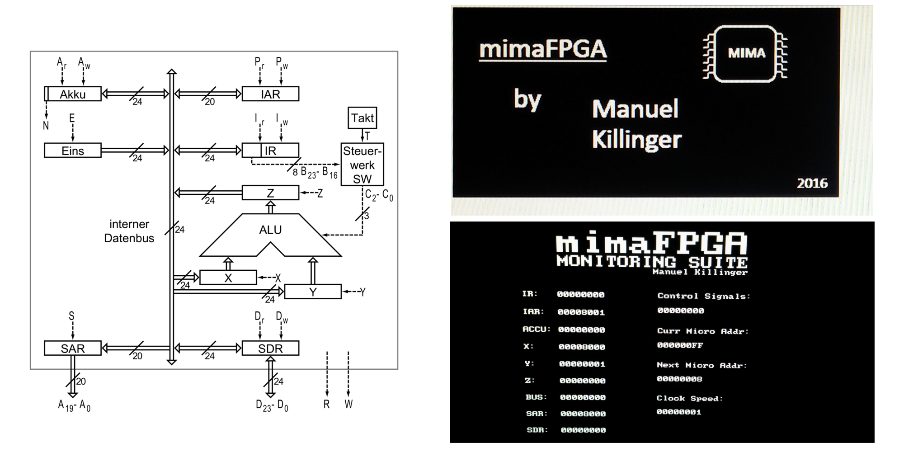

# mimaFPGA

A VHDL implementation of the Minimal Machine processor taught at the Karlsruhe Institute of Technology.



### Table of contents

- [Introduction](#introduction)
- [Features](#features)
- [VHDL Component description](#vhdl-component-description)
    + [Top Module: MIMAProcessor.vhd](#top-module-mimaprocessorvhd)
    + [Top Module: MIMAEnvironment.vhd](#top-module-mimaenvironmentvhd)
- [How to get this running on your FPGA?](#how-to-get-this-running-on-your-fpga)
      - [VERY IMPORTANT NOTE](#very-important-note)
- [MIMA Specification](#mima-specification)
  * [Architecture of the MIMA](#architecture-of-the-mima)
    + [Registers](#registers)
    + [ALU operations](#alu-operations)
  * [Instruction set](#instruction-set)
    + [Instruction format](#instruction-format)
    + [Op-Codes](#op-codes)
- [Advanced description of the MIMA architecture](#advanced-description-of-the-mima-architecture)
  * [Execution cycle](#execution-cycle)
  * [Micro instruction format](#micro-instruction-format)
  * [Memory timing](#memory-timing)
- [Mentions](#mentions)
- [More stuff to work on](#more-stuff-to-work-on)


## Introduction
The Minimal Machine is not just a hypotetical processor anymore. With this project the MIMA becomes a real processor, capable of running even complex programs up to a virtual machine or even an operating system.
I've provided not just the processor itself, but embedded it in an environment with __memory__, a 512 by 256 pixel memory mapped __screen__, a __ps/2 interface__ to connect a keyboard, a __register monitoring suite__ and __clock speed control__.
The memory mapped screen and the monitoring suite are accessible via a vga interface and can be switched between.
To fully enjoy this design, your FPGA board should be equipped with four buttons, a vga connector and if possible a ps/2 connector.

## Features
* __register monitoring suite__: The monitoring suite lets you display all the necessary information on your vga monitor. It shows all the register stati, the current micro instruction and the address of the next micro instruction to be executed. It also displays the MIMAs clock frequency. To fully enjoy this, clock the processor down to a slow speed, load a program and enjoy!
* __memory mapped screen__: The screen is 512x256 pixels in size. You can have the MIMA write to the adresses 0x04000 to 0x5FFF. Every bit in that area represents a pixel on screen. The organisation is as follows: Every word in this segment is 16 bit wide, one word represents a 16 pixel array on screen. 32 such arrays make up one row of the screen.
* __memory__: The MIMA can address 1MiB of Memory containing 24 bit data words. This is far too much for a FPGA that a student could affort. I decided to scale this down and split the memory in distinct segments to serve different purposes:
    * __heap__ spans from 0x00001 to 0x03FFF, 16K locations, 16 bit words, not sign extended
    * __screen memory__ map spans from 0x04000 to 0x05FFF, 8K locations, 16 bit words, write only
    * __keyborad__ mapping is a single memory location at 0x06000, read only
    * __program rom__ spans from 0x08000 to 0x0FFFF, 32K locations, 24 bit words, read only
    * address 0x00000 is reserved for a JMP 0x08000 instruction, which is executed first at startup and will make the mima perform a jump to the program rom
* __clock control__: Assign the speed_up and speed_down inputs of the design to buttons and change the clock speed in a range of 1 Hz to 20 MHz.
* __keyboard support__: The keyboard can be connected via a ps/2 interface. The ascii value of the last pressed button is written to location 0x06000 in memory and can be accessed there.

## VHDL Component description

#### Top Module: MIMAProcessor.vhd
##### input ports:
* __mem_din__: STD_LOGIC_VECTOR(23 downto 0): data input from memory, feeds into SDR
* __mem_sdr_we__: STD_LOGIC: write enable for the internal storage address register. Should be high in the same cycle when new data is present at the mem_din port
* __rst__: STD_LOGIC: synchronous reset
* __clk__ : STD_LOGIC: system clock

##### output ports:
* __mem_dout__: STD_LOGIC_VECTOR(23 downto 0): data output to memory, comes from SDR
* __mem_addr__: STD_LOGIC_VECTOR(19 downto 0): address output to memory
* __mem_re__: STD_LOGIC: read signal for read requests
* __mem_we__: STD_LOGIC: write signal for write requests
* __monitoring__: MONITORING_SIGNALS: some register values bundled in a record, defined in the mimacommons package

#### Top Module: MIMAEnvironment.vhd
##### input ports:
* __speed_up__: STD_LOGIC: low active, speed gets increased at falling edge
* __speed_down__: STD_LOGIC: low active, speed gets decreased at falling edge 
* __screen_select__: STD_LOGIC: switch between vga views; 0: monitoring suite, 1: memory mapped screen
* __ps2_clk__: STD_LOGIC: ps/2 keyboard clk input
* __ps2_data__: STD_LOGIC: ps/2 keyboard data input
* __reset__: STD_LOGIC: synchronous reset
* __clk__: STD_LOGIC: system clk

##### output ports:
* __r__: STD_LOGIC_VECTOR(4 downto 0): red pixel value for the vga controller
* __g__: STD_LOGIC_VECTOR(5 downto 0): green pixel value for the vga controller 
* __b__: STD_LOGIC_VECTOR(4 downto 0): blue pixel value for the vga controller
* __hsync__: STD_LOGIC: hsync signal for the vga controller
* __vsync__: STD_LOGIC: vsync signal for the vga controller

## How to get this running on your FPGA?

The Project is seperated into two folders. The [mima_processor](mima_processor) folder only contains the vhdl files for the MIMA processor itself, without any additional functionality, implemented exactly how it's specified. The design does not use any cores that have to be regenerated, so it should work by selecting the mimaProcessor.vhd as top module.

The [mima_environment](moma_environment) folder contains vhdl files that give the above described additional functionality. This one is a bit trickier to get running, as it requires the regeneration of some ipcores. First you will need to include the files from both folders into your project and select the "MIMAEnvironment.vhd" as top module.

Next you will have to regenerate the clock frequency core located in the top Module "MIMAEnvironment.vhd". The output clock must be running at 40 MHz, this is needed by the VGA syncer component to generate the proper vga timing. 
Next up are three cores located in the "MemoryController.vhd". These cores provide the MIMA with memory. As my developement FPGA was not equipped with enough RAM blocks, I had to shrink the MIMAs accessible memory space. There are three memory regions the MIMA can access: The program rom, a heap area and the screen memory. The program memory in my design is read only and was generated using distributed rom. Program rom data words are 24 bits wide. The heap area is a simple single port ram, containing 16 bit words. For the screen memory use a simple dual port ram, the MIMA can write to it while the syncer component has to be able to acess that ram asynchronously to retrieve the correct pixel data. The screen memory words are 16 bit in width as well.

Finally choose a program, load it into the program rom and enjoy!
I have provided a few example programs in the [example_programs](example_programs) folder, these are stored in xilinx .coe files. If you are working with a different fpga brand you should be fine by opening it with a standard editor and copying out the program code. Apart from that feel free to write own programs and run them, just remember that the program memory starts at address 0x8000! 

##### VERY IMPORTANT NOTE
Make sure all memory cores have exactly one cycle delay for read access (the screen memory too)! Doing otherwise might result in reading the wrong data from memory!

## MIMA Specification

### Architecture of the MIMA

#### Registers

* Acc: Accumulator
* X: first ALU operand register
* Y: second ALU operand register
* Z: ALU result register
* One: constant 1
* IAR: instruction address register
* IR: instruction register
* SAR: storage address register
* SDR: storage data register

#### ALU operations

ALU control	| Operation
:------:|:---------
000		| do nothing (0 --> Z)
001		| X + Y --> Z
010		| rotate X to the right --> Z
011		| X and Y --> Z
100		| X or Y --> Z
101		| X xor Y --> Z
110		| not X --> Z
111		| Z <-- (X == Y) ? -1 : 0

### Instruction set

#### Instruction format

20 bit operand format:
```
OpCode | Operand 
 oooo    xxxx xxxx xxxx xxxx xxxx
```

No operand format:
```
   OpCode   | 
 1111 oooo    xxxx xxxx xxxx xxxx
```

#### Op-Codes

OpCode 	| Mnemonik	| Description
:--:|:----------|:-----------
0	| LDC c		| c --> Acc
1	| LDV a		| [a] --> Acc
2	| STV a		| Acc --> [a]
3	| ADD a		| Acc + [a] --> Acc
4	| AND a		| Acc and [a] --> Acc
5	| OR a		| Acc or [a] --> Acc
6	| XOR a		| Acc xor [a] --> Acc
7	| EQL a		| if (Acc == [a]) {-1 --> Acc} else {0 --> Acc}
8	| JMP a		| jump to address a
9	| JMN a		| jump to address a if Acc < 0
A	| LDIV a	| [[a]] --> Acc
B	| STIV a	| Acc --> [[a]]
C	| JMS a		| jump subroutine (see below)
D	| JIND a	| jump indirect (see below)
E	|		    | free
F0	| HALT		| stops the minimal machine
F1	| NOT		| not Acc --> Acc
F2	| RAR		| rotates Acc on the the right --> Acc
F3 - FF	|		| free

##### Notes
* Bits shifted out right within a __RAR__ command will be pushed in at the left.
* The instruction __JMS target__ saves the address of the succeeding instruction (return address) to the address given by target and initiates a jump to target + 1.
* __JIND target__ initiates a jump to the address which is stored at the target address. (JMP [target])
* __[a]__: value at the address a, __[[a]]__: value at the adress pointed at by [a] 


## Advanced description of the MIMA architecture
This implementation strictly follows the specifications that were provided in the lectures and tutorials taught at the KIT. Even the micro instructions are the original ones and not optimized, though this might be adressed in the future. This way it is ensured that the implemented processor closely represents the capabilities of the one that is taught in the lectures. Also it is easier using the monitoring suite to follow what is happening. 

### Execution cycle
The first micro instructions executed are located starting from address 0 in the micro instruction rom, which is the FETCH function. It will load the next machine instruction from memory into the IR. After an instruction fetch, the next micro instruction to be executet resides at adress 255. This instruction is special, as the control unit will now look up the function entry point of the micro funtion, which is located somewhere in the micro instruction rom and execute the first instruction of that function next. The function entry points are stored in the function entry rom and looked up based off the OpCode of the machine instruction that was just loaded in the IR. From there on the function will be executed and finally jump back to the FETCH function.

### Micro instruction format

The micro instructions are the instructions controlling which registers can write to the bus, read from the bus, control the alu operations and send read or write requests to the memory. Each micro instruction also has a NEXT_ADDR field specifying the address of the next micro instruction to be executed. The micro instruction is a 28 bit wide vector where every bit has a specific function, as described below.


MICRO INSTRUCTION FORMAT:
```
Ar Aw X Y Z E Pr Pw Ir Iw Dr Dw S CCC R W  RR NEXT_ADDR
x  x  x x x x x  x  x  x  x  x  x xxx x x  00 xxxxxxxx
```
* You might have noticed that the micro instruction contains two reserved bits, which are not used and thus not implemented or further explained.

Data bus access; for convenience read means reading from the bus, then setting the register to that value and write means writing to the bus:
```
Ar: Accu reads
Aw: Accu writes
X: X register reads
Y : Y register reads
Z: Z register writes
E: One register writes
Pr: IAR reads
Pw: IAR writes
Ir: IR reads
Iw: IR writes
Dr: SDR reads
Dw: SDR writes
S: SAR reads
```
For the ALU control:
```
CCC: ALU control signals
```
For memory access:
```
R: read request
W: write request
```
The actual used addresses in the micro instrucrion rom:
```
ADDR: location of the instraction in the micro instruction rom
NEXT_ADDR: next address to execute
``` 
    
All the currently supported micro instructions implemented in hardware:
```
ADDR |OPC       |FUNC                   |Ar Aw X Y Z E Pr Pw Ir Iw Dr Dw S CCC R W  |NEXT_ADDR
0    |FETCH     |IAR -> SAR, X; R = '1' |0  0  1 0 0 0 0  1  0  0  0  0  1 000 1 0  |1
1               |E -> Y; R = '1'        |0  0  0 1 0 1 0  0  0  0  0  0  0 000 1 0  |2
2               |ADD; R = '1'           |0  0  0 0 0 0 0  0  0  0  0  0  0 001 1 0  |3
3               |Z -> IAR               |0  0  0 0 1 0 1  0  0  0  0  0  0 000 0 0  |4
4               |SDR -> IR              |0  0  0 0 0 0 0  0  1  0  0  1  0 000 0 0  |255

8   |LDC c		|IR -> Acc              |1  0  0 0 0 0 0  0  0  1  0  0  0 000 0 0  |0

12  |LDV a      |IR -> SAR; R = '1'     |0  0  0 0 0 0 0  0  0  1  0  0  1 000 1 0  |13
13	            |R = '1'                |0  0  0 0 0 0 0  0  0  0  0  0  0 000 1 0  |14
14              |R = '1'                |0  0  0 0 0 0 0  0  0  0  0  0  0 000 1 0  |15
15              |SDR -> Acc             |1  0  0 0 0 0 0  0  0  0  0  1  0 000 0 0  |0

20  |STV a	    |Acc -> SDR             |0  1  0 0 0 0 0  0  0  0  1  0  0 000 0 0  |21
21              |IR -> SAR; W = '1'     |0  0  0 0 0 0 0  0  0  1  0  0  1 000 0 1  |22
22              |W = '1'                |0  0  0 0 0 0 0  0  0  0  0  0  0 000 0 1  |23
23              |W = '1'                |0  0  0 0 0 0 0  0  0  0  0  0  0 000 0 1  |0

28  |ADD a	    |IR -> SAR; R = '1'     |0  0  0 0 0 0 0  0  0  1  0  0  1 000 1 0  |29
28              |Acc -> X; R = '1'      |0  1  1 0 0 0 0  0  0  0  0  0  0 000 1 0  |30
30              |R = '1'                |0  0  0 0 0 0 0  0  0  0  0  0  0 000 1 0  |31
31              |SDR -> Y               |0  0  0 1 0 0 0  0  0  0  0  1  0 000 0 0  |32
32              |ADD                    |0  0  0 0 0 0 0  0  0  0  0  0  0 001 0 0  |33
33              |Z -> Acc               |1  0  0 0 1 0 0  0  0  0  0  0  0 000 0 0  |0

36  |AND a    	|IR -> SAR; D = '1'     |0  0  0 0 0 0 0  0  0  1  0  0  1 000 1 0  |37
37	            |Acc -> X; R = '1'      |0  1  1 0 0 0 0  0  0  0  0  0  0 000 1 0  |38
38			    |R = '1'                |0  0  0 0 0 0 0  0  0  0  0  0  0 000 1 0  |39
39		        |SDR -> Y               |0  0  0 1 0 0 0  0  0  0  0  1  0 000 0 0  |40
40		        |AND                    |0  0  0 0 0 0 0  0  0  0  0  0  0 011 0 0  |41
41		        |Z -> Acc               |1  0  0 0 1 0 0  0  0  0  0  0  0 000 0 0  |0

44  |OR a	    |IR -> SAR; D = '1'     |0  0  0 0 0 0 0  0  0  1  0  0  1 000 1 0  |45
45              |Acc -> X; R = '1'      |0  1  1 0 0 0 0  0  0  0  0  0  0 000 1 0  |46
46		        |R = '1'                |0  0  0 0 0 0 0  0  0  0  0  0  0 000 1 0  |47
47	            |SDR -> Y               |0  0  0 1 0 0 0  0  0  0  0  1  0 000 0 0  |48
48	            |OR                     |0  0  0 0 0 0 0  0  0  0  0  0  0 100 0 0  |49
49		        |Z -> Acc               |1  0  0 0 1 0 0  0  0  0  0  0  0 000 0 0  |0

52  |XOR a	    |IR -> SAR; D = '1'     |0  0  0 0 0 0 0  0  0  1  0  0  1 000 1 0  |53
53		        |Acc -> X; R = '1'      |0  1  1 0 0 0 0  0  0  0  0  0  0 000 1 0  |54
54		        |R = '1'                |0  0  0 0 0 0 0  0  0  0  0  0  0 000 1 0  |55
55		        |SDR -> Y               |0  0  0 1 0 0 0  0  0  0  0  1  0 000 0 0  |56
56		        |XOR                    |0  0  0 0 0 0 0  0  0  0  0  0  0 101 0 0  |57
57		        |Z -> Acc               |1  0  0 0 1 0 0  0  0  0  0  0  0 000 0 0  |0

60  |EQL a	    |IR -> SAR; R = '1'     |0  0  0 0 0 0 0  0  0  1  0  0  1 000 1 0  |61
61			    |Acc -> X; R = '1'      |0  1  1 0 0 0 0  0  0  0  0  0  0 000 1 0  |62
62	            |R = '1'                |0  0  0 0 0 0 0  0  0  0  0  0  0 000 1 0  |63
63		        |SDR -> Y               |0  0  0 1 0 0 0  0  0  0  0  1  0 000 0 0  |64
64	            |EQL                    |0  0  0 0 0 0 0  0  0  0  0  0  0 111 0 0  |65
65			    |Z -> Acc               |1  0  0 0 1 0 0  0  0  0  0  0  0 000 0 0  |0

68  |JMP a 	    |IR -> IAR              |0  0  0 0 0 0 1  0  0  1  0  0  0 000 0 0  |0

72  |JMN a		|E -> X                 |0  0  1 0 0 1 0  0  0  0  0  0  0 000 0 0  |73
73	            |ROR; Acc -> Y          |0  1  0 1 0 0 0  0  0  0  0  0  0 010 0 0  |74
74		        |Z -> X                 |0  0  1 0 1 0 0  0  0  0  0  0  0 000 0 0  |75
75	            |AND                    |0  0  0 0 0 0 0  0  0  0  0  0  0 011 0 0  |76
76		        |Z -> Y                 |0  0  0 1 1 0 0  0  0  0  0  0  0 000 0 0  |77
77		        |EQL; R -> Y            |0  0  0 1 0 0 0  0  0  1  0  0  0 111 0 0  |78
78		        |Z -> X                 |0  0  1 0 1 0 0  0  0  0  0  0  0 000 0 0  |79
79	            |AND; IAR -> Y          |0  0  0 1 0 0 0  1  0  0  0  0  0 011 0 0  |80
80	            |NOT; Z -> SDR          |0  0  0 0 1 0 0  0  0  0  1  0  0 110 0 0  |81
81	            |Z -> X                 |0  0  1 0 1 0 0  0  0  0  0  0  0 000 0 0  |82
82	            |AND; SDR -> X          |0  0  1 0 0 0 0  0  0  0  0  1  0 011 0 0  |83
83	            |Z -> Y                 |0  0  0 1 1 0 0  0  0  0  0  0  0 000 0 0  |84
84	            |OR                     |0  0  0 0 0 0 0  0  0  0  0  0  0 100 0 0  |85
85		        |Z -> IAR               |0  0  0 0 1 0 1  0  0  0  0  0  0 000 0 0  |0

88  |NOT	    |Acc -> X               |0  1  1 0 0 0 0  0  0  0  0  0  0 000 0 0  |89
89		        |NOT                    |0  0  0 0 0 0 0  0  0  0  0  0  0 110 0 0  |90
90	            |Z -> Acc               |1  0  0 0 1 0 0  0  0  0  0  0  0 000 0 0  |0

96  |RAR		|Acc -> X               |0  1  1 0 0 0 0  0  0  0  0  0  0 000 0 0  |97
97	            |ROR                    |0  0  0 0 0 0 0  0  0  0  0  0  0 010 0 0  |98
98		        |Z -> Acc               |1  0  0 0 1 0 0  0  0  0  0  0  0 000 0 0  |0

100	|LDIV a     |IR -> SAR; R = '1'     |0  0  0 0 0 0 0  0  0  1  0  0  1 000 1 0  |101
101	            |R = '1'                |0  0  0 0 0 0 0  0  0  0  0  0  0 000 1 0  |102
102             |R = '1'                |0  0  0 0 0 0 0  0  0  0  0  0  0 000 1 0  |103
103			    |SDR -> SAR; R = '1'    |0  0  0 0 0 0 0  0  0  0  0  1  1 000 1 0  |104
104	            |R = '1'                |0  0  0 0 0 0 0  0  0  0  0  0  0 000 1 0  |105
105	            |R = '1'                |0  0  0 0 0 0 0  0  0  0  0  0  0 000 1 0  |106
106	            |SDR -> Acc             |1  0  0 0 0 0 0  0  0  0  0  1  0 000 0 0  |0

112	|STIV a     |IR -> SAR; R = '1'     |0  0  0 0 0 0 0  0  0  1  0  0  1 000 1 0  |113
113		        |R = '1'                |0  0  0 0 0 0 0  0  0  0  0  0  0 000 1 0  |114
114	            |R = '1'                |0  0  0 0 0 0 0  0  0  0  0  0  0 000 1 0  |115
115	            |SDR -> SAR             |0  0  0 0 0 0 0  0  0  0  0  1  1 000 0 0  |116
116	            |Acc -> SDR; W = '1'    |0  1  0 0 0 0 0  0  0  0  1  0  0 000 0 1  |117
117	            |W = '1'                |0  0  0 0 0 0 0  0  0  0  0  0  0 000 0 1  |118
118	            |W = '1'                |0  0  0 0 0 0 0  0  0  0  0  0  0 000 0 1  |0

124	|JMS a		|IAR -> SDR             |0  0  0 0 0 0 0  1  0  0  1  0  0 000 0 0  |125
125	            |IR -> SAR, X; W = '1'  |0  0  0 0 0 0 0  0  0  1  0  0  1 000 0 1  |126
126             |E -> Y; W = '1'        |0  0  0 1 0 1 0  0  0  0  0  0  0 000 0 1  |127
127	            |ADD; W = '1'           |0  0  0 0 0 0 0  0  0  0  0  0  0 001 0 1  |128
128	            |Z -> SAR; R = '1'      |0  0  0 0 1 0 0  0  0  0  0  0  1 000 1 0  |129
129             |R = '1'                |0  0  0 0 0 0 0  0  0  0  0  0  0 000 1 0  |130
130	            |R = '1'                |0  0  0 0 0 0 0  0  0  0  0  0  0 000 1 0  |131
131	            |SDR -> IAR             |0  0  0 0 0 0 1  0  0  0  0  1  0 000 0 0  |0

136	|JIND a	    |IR -> SAR; R = '1'     |0  0  0 0 0 0 0  0  0  1  0  0  1 000 1 0  |137
137	            |R = '1'                |0  0  0 0 0 0 0  0  0  0  0  0  0 000 1 0  |138
138	            |R = '1'                |0  0  0 0 0 0 0  0  0  0  0  0  0 000 1 0  |139
139	            |SDR -> IAR             |0  0  0 0 0 0 1  0  0  0  0  1  0 000 0 0  |0

255 |reserved for the cu to jump        |0  0  0 0 0 0 0  0  0  0  0  0  0 000 0 0  |0
    |to the decoded functions  
```
##### Notes
*  The MIMA architecture diagram displays a negative flag from the accumulator register, but it is nowhere specified how it is adressed. Therefore it is not implemented, leading to the __JMN__ instructions implementation being a bit more complex. To function correctly the JMN instruction uses the SDR as temporary register, therefore the memory controller must only write to the SDR after a read request! 
* The above described instructions are not optimized to closely mimic the instructions tought in the lectures. But due to the implementation of the bus using multiplexers, for instance the OR instruction could be shortened by writing the Accumulator and the SDR to the bus simultaniously, not using the ALU at all!


### Memory timing
* Memory reads or writes take 3 cycles.
* After pulling the the Read signal high for 3 cycles, the read data has to be present in the SDR beginning of the 4th cycle.
* The read and rrite signals can already be pulled high in the same cycle that is still written to the SAR or SDR register.

The last point might lead to confusion and misbehaviour if not considered, as it is perfectly valid to write to the sar or sdr registers already at the same cycle the write or read signals for the memory are high.
The problem is that registers are only updated at the rising edge of the next cycle, but the write and read signals are routed directly fom the control unit out of the processor, meaning that the memory controller has to take care of delaying these two signals by one cycle, otherwise faulty reads or worse, writes to wrong memory locations could occurr.
For example take a look at the implementation of the STV instruction:

__STV a:__     
```
1: Acc -> SDR
2: IR -> SAR; W = '1'
3: W = '1'
4: W = '1'
```

Consider the memory controller wouldn't add the necessary delay stage for the write signal, the controller would
get the signal to write aleady in cycle 2, whereas the SAR is updated at the beginning of cycle 3. Thus the memory would write to the address that was stored in the SAR before cycle 3.

## Mentions
* Three files from the ps/2 interface are from [eewiki](https://eewiki.net/pages/viewpage.action?pageId=28278929)
* To compile your MIMA programs online check out this awesome [project](https://github.com/phiresky/mima)

## More stuff to work on
  - design a compiler to run higher level programs
  - optimize hardware and micro instructions to create a faster design
  - develop an extended instruction set
  - single step mode
  - make heap memory sign extend on reads
